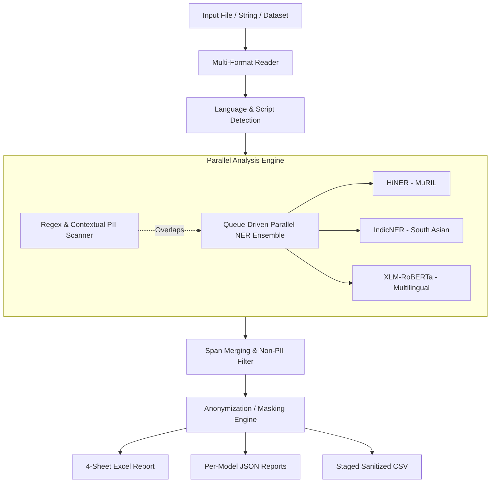

# Architecture Overview — Grievance Data Anonymization

The **Grievance Data Anonymization Pipeline** is designed for multi-format text ingestion, structured & contextual PII scanning, parallel multilingual Named Entity Recognition (NER) inference, and comprehensive Excel/JSON audit reporting.

---

## 1. System Components & Flow

---

## 2. PII Detection Engine

The pipeline runs two parallel passes over input text:

1. **Structured Regex & Contextual Regex Scanner**:
   - Matches standard identifiers: Aadhaar (`XXXX XXXX 1234`), PAN, Voter ID, Passport, Driving License, PPP Family ID, Vehicle Number, Phone, Email, IP Address, IFSC, Pincode, Age.
   - Computes 1-based line numbers, word ordinal positions (`1st`, `2nd`), letter character start/end offsets, and confidence scores.

2. **Multilingual NER Ensemble**:
   - **HiNER (`cfilt/HiNER-original-muril-base-cased`)**: Optimized for Indic and Devanagari scripts.
   - **IndicNER (`ai4bharat/IndicNER`)**: South Asian entity extraction.
   - **XLM-RoBERTa (`Babelscape/wikineural-multilingual-ner`)**: Multilingual cross-lingual transfer.
   - **Hybrid**: Ensembles all three models using Non-Maximum Suppression (NMS) and boundary snapping to resolve overlapping entity spans.

---

## 3. High-Performance Deduplicated Batch Pipeline

For large-scale dataset exports (CSV/Excel/JSON):

1. **Corpus Deduplication**: Collects distinct line entries across configured columns. In administrative grievance datasets, up to 80% of text entries are repetitive boilerplate, so deduplication collapses inference time drastically.
2. **Corpus-Level Mini-Batching**: Runs single-pass inference across the corpus using PyTorch CPU single-thread isolation to prevent thread thrashing.
3. **Span Projection**: Projects detected entity spans back to every cell containing that line in the original dataset.

---

## 4. Anonymization Strategies

- **Partial Masking**: Aadhaar (`XXXX XXXX 1234`), Phone (`XXXXXX9876`), Bank Account (`********5678`), PAN (`ABCDE****F`).
- **Domain-Preserving Masking**: Email (`jo****@domain.com`).
- **Tokenization**: Credit Card (`XXXX-XXXX-XXXX-4321`).
- **Initial-Only Masking**: Person Names (`R. K. S.`).
- **One-Way Hashing**: SHA-256 salted hash for generic tokens.
